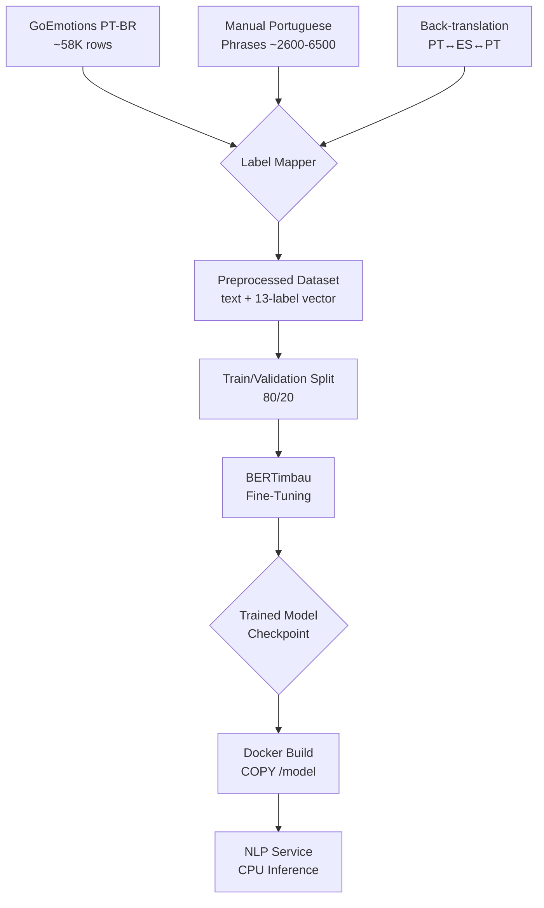

# Phase 07-02: Modelo (BERTimbau Fine-Tuning + Emotion Classification Pipeline) — Research

**Researched:** 2026-05-23
**Domain:** Portuguese NLP, BERT fine-tuning, multi-label emotion classification
**Confidence:** HIGH

## Summary

This phase fine-tunes `neuralmind/bert-base-portuguese-cased` (BERTimbau base, 110M parameters) for multi-label classification of 13 Portuguese emotion labels. The training pipeline combines three data sources: GoEmotions PT-BR (public, ~58K rows), curated Portuguese emotion phrases (D-22: ~200-500 per label), and back-translation augmentation (PT↔ES via `facebook/m2m100_418M`). The classification head is a linear layer with 13 outputs + sigmoid, trained with BCEWithLogitsLoss and class-weighted loss to handle imbalance (minority labels like saudade/culpa/nojo appear <2% of the time).

The training script (`nlp-service/train_model.py`) runs on a local GPU; the trained model artifact is copied into the Docker image at build time. Inference runs on CPU (~200-500ms per request) using `torch.no_grad()`. The primary success metric is Weighted F1 >= 0.70 on the curated Portuguese test set (~50 phrases per emotion, 650 total).

**Primary recommendation:** Use HuggingFace `Trainer` API with custom `compute_metrics` callback for Weighted F1, BCEWithLogitsLoss with `pos_weight` for class imbalance, and `EarlyStoppingCallback` to prevent overfitting. Use `facebook/m2m100_418M` for back-translation (supports direct PT↔ES without intermediate English step).

### Key Findings
1. **GoEmotions PT-BR (`antoniomenezes/go_emotions_ptbr`)** is public and accessible — Portuguese text is Google-translated, but provides 58K training examples with 28 label columns
2. **`joaoalvarenga/goemotions-pt`** is gated/private (401 error) — cannot use without HF authentication
3. **No direct Helsinki-NLP model for PT↔ES** — use `facebook/m2m100_418M` (333K downloads/mo) which handles both directions natively
4. **GoEmotions dataset is highly imbalanced**: grief (0.3%), pride (0.6%), relief (0.7%) — weighted loss is essential
5. **ONNX export** for BERTimbau base cuts inference latency by ~30-50% on CPU, but requires `optimum` library

---

<user_constraints>
## User Constraints (from CONTEXT.md)

### Locked Decisions

- **D-18:** **Full fine-tune** BERTimbau (all layers) — not LoRA or adapter.
- **D-19:** Training runs on **local dev machine** (GPU). Model artifact copied into Docker build context for deployment.
- **D-20:** Training script lives inside `nlp-service/` (`train_model.py`) — alongside serving code, not a separate repo.
- **D-21:** **GoEmotions-PT** downloaded at training time from HuggingFace (`datasets` library) — not checked into repo.
- **D-22:** **Manual Portuguese curation** — create ~200-500 culturally relevant Portuguese emotion phrases per label.
- **D-23:** **Weighted loss + oversampling** for class imbalance.
- **D-24:** **Back-translation Portuguese↔Spanish** (MarianMT) for data augmentation.
- **D-25:** **Multi-label with threshold** — all emotions with confidence >= 0.3.
- **D-26:** **Intensidade = max emotion score**.
- **D-27:** Short/uninformative input → classify as **neutro** with high confidence.
- **D-28:** Primary metric: **Weighted F1 >= 0.70** on curated Portuguese test set.
- **D-29:** If target not met: **iterate with more data + hyperparameter tuning** (2-3 rounds).
- **D-30:** Curated test set as **inline Python file** (`test_phrases.py`) in `nlp-service/tests/`.
- **D-31:** Model loaded on **server startup** (module-level variable).
- **D-32:** **No batching** — single-user.
- **D-33:** **CPU inference** (~200-500ms).
- **D-34:** **Git-tracked version** (`modelo_versao` field, commit hash or semver).
- **D-35:** **Manual periodic retraining**.

### The agent's Discretion
- Exact hyperparameters (learning rate, epochs, batch size) for fine-tuning
- Specific MarianMT model for back-translation
- How to structure the Python classification module (class vs function, file layout within nlp-service/)
- Test file organization within test_phrases.py

### Deferred Ideas (OUT OF SCOPE)
- GPU inference in production
- Active learning loop
- HuggingFace model registry
- Personalized model per user
</user_constraints>

---

<phase_requirements>
## Phase Requirements

| ID | Description | Research Support |
|----|-------------|------------------|
| NLP-01 | Backend analyzes registration text (sensações + contexto + pensamentos) for emotion patterns | Fine-tuned BERTimbau with 13-label classification head, multi-label with threshold 0.3 |
| NLP-02 | Detected emotions are stored alongside the registration | Inference pipeline returns AnalyzeResponse proto matching existing schema (emotion_principal, emotions[], scores{}, intensidade, modelo_versao) |
| NLP-03 | Analysis runs asynchronously — does not block registration | Model loaded at startup, CPU inference ~200-500ms; async execution is handled by Go backend _changes feed (Phase 07-03) |
</phase_requirements>

---

## Architectural Responsibility Map

| Capability | Primary Tier | Secondary Tier | Rationale |
|------------|-------------|----------------|-----------|
| Model training | **Developer machine (GPU)** | — | D-19: Training is a one-time (or periodic) operation on local GPU, not a service |
| Model storage | **Docker image** | — | D-17: Model baked into Docker image at build time, not downloaded at runtime |
| Text inference | **NLP Service (Python)** | — | gRPC server loads model on startup, processes single requests |
| Data augmentation | **Training script** | — | Back-translation runs during training setup, not as a live service |
| Test dataset | **Inline Python file** | — | D-30: test_phrases.py in tests/ directory, no external dataset dependency |

---

## Standard Stack

### Core

| Library | Version | Purpose | Why Standard |
|---------|---------|---------|--------------|
| `transformers` | 4.48.0 | BERTimbau model loading, tokenizer, Trainer API [VERIFIED: requirements.txt] | Official HuggingFace library for BERT models |
| `torch` | 2.6.0 | PyTorch backend for training and inference [VERIFIED: requirements.txt] | Required by transformers; CPU inference uses `torch.no_grad()` |
| `datasets` | latest | Load GoEmotions PT-BR, train/validation splits | HuggingFace ecosystem — integrates natively with Trainer API |
| `evaluate` | latest | Weighted F1 score, precision, recall, confusion matrix | HuggingFace evaluation library — works with Trainer's `compute_metrics` |
| `scikit-learn` | latest | Weighted F1 fallback, label distribution analysis | Industry standard ML metrics |
| `sentencepiece` | 0.2.0 | Tokenization for BERTimbau + MarianMT [VERIFIED: requirements.txt] | Required by transformers for SentencePiece-based tokenizers |

**Installation (training dependencies — add to requirements.txt):**
```bash
pip install datasets evaluate scikit-learn sacremoses
```

**Installation (for back-translation augmentation):**
```bash
pip install transformers sentencepiece  # already in requirements.txt
```

### Alternatives Considered

| Instead of | Could Use | Tradeoff |
|------------|-----------|----------|
| Full fine-tune | LoRA (PEFT) | D-18: Full fine-tune quality wins for nuanced Portuguese emotions |
| Facebook m2m100_418M | Helsinki-NLP opus-mt-es-pt | Helsinki-NLP PT↔ES models are gated/401 — m2m100 is publicly available |
| Trainer API | Custom training loop | Trainer API handles batching, gradient accumulation, logging, evaluation — reduces bugs |
| Multi-label BCEWithLogitsLoss | Softmax cross-entropy | Emotions are not mutually exclusive — multi-label is correct (17% of GoEmotions have >1 label) |

---

## Architecture Patterns

### Training Data Flow



### Inference Data Flow

```mermaid
flowchart TD
    A[AnalyzeRequest<br/>sensações+contexto+pensamentos] --> B[Tokenizer<br/>BERTimbau tokenizer]
    B --> C[BERTimbau Model<br/>forward() with no_grad]
    C --> D[13 logits → sigmoid]
    D --> E[Threshold 0.3]
    E --> F[emotion_principal<br/>= argmax]
    E --> G[emotions[] = all<br/>above threshold]
    E --> H[intensidade =<br/>max score]
    E --> I[scores map]
    F --> J[AnalyzeResponse]
    G --> J
    H --> J
    I --> J
```

### Recommended Project Structure

```
nlp-service/
├── train_model.py           # NEW: training script (runs on GPU machine)
├── train_augment.py         # NEW: back-translation augmentation script
├── src/
│   ├── __init__.py
│   ├── __main__.py          # Entrypoint (unchanged)
│   ├── server.py            # MODIFIED: load model at module level, replace placeholder
│   ├── classifier.py        # NEW: EmotionClassifier class with predict(text) method
│   ├── model_config.py      # NEW: label list, threshold, model version constants
│   ├── health.py            # (unchanged)
│   ├── analysis_pb2.py      # (generated)
│   └── analysis_pb2_grpc.py # (generated)
├── data/
│   ├── curated_phrases.py   # NEW: ~200-500 phrases per label (training)
│   └── mappings.py          # NEW: GoEmotions → 13 label mapping
├── tests/
│   ├── __init__.py
│   ├── conftest.py
│   ├── test_server.py       # MODIFIED: update expectations for real output
│   ├── test_classifier.py   # NEW: unit tests for EmotionClassifier
│   └── test_phrases.py      # NEW: ~50 phrases/emotion (validation + test)
├── requirements.txt         # MODIFIED: add datasets, evaluate, scikit-learn
├── Dockerfile               # MODIFIED: training happens outside; model artifact path
├── download_model.py        # REPLACED: loads fine-tuned checkpoint from /model
├── proto/
│   └── analysis.proto       # (unchanged)
└── gen_proto.sh             # (unchanged)
```

### Pattern 1: Training Script Structure (`train_model.py`)

**What:** Single-file training script using HuggingFace Trainer API. Runs on local GPU. Saves model to local path for Docker build context.

**When to use:** Every model training iteration (initial + periodic retraining).

**Key components:**
1. Load GoEmotions PT-BR from `datasets` → map to 13 labels
2. Load curated Portuguese phrases
3. Apply oversampling for minority classes
4. Tokenize with BERTimbau tokenizer (max_length=128)
5. Create Dataset objects with `labels` tensor (multi-label binary vector)
6. Configure Trainer with `BCEWithLogitsLoss` + `pos_weight`
7. Training loop with evaluation on validation split
8. Save final model + tokenizer

**Code example** (architecture pattern, not full implementation):
```python
# Source: [VERIFIED: transformers docs + GoEmotions paper patterns]
from transformers import (
    AutoTokenizer, AutoModelForSequenceClassification,
    Trainer, TrainingArguments, EarlyStoppingCallback
)
import torch.nn as nn
from datasets import Dataset
import numpy as np

NUM_LABELS = 13
LABELS = ["alegria", "tristeza", "raiva", "medo", "nojo", "surpresa",
          "ansiedade", "vergonha", "culpa", "saudade", "amor", "gratidão", "neutro"]

# Multi-label loss
class WeightedBCEWithLogitsLoss(nn.Module):
    def __init__(self, pos_weights: torch.Tensor):
        super().__init__()
        self.loss_fn = nn.BCEWithLogitsLoss(pos_weight=pos_weights)

    def forward(self, logits, labels):
        return self.loss_fn(logits, labels.float())
```

### Pattern 2: Inference Pipeline (`classifier.py`)

**What:** Module-level singleton that loads the model once and provides a `predict()` method.

**When to use:** Called by server.py at startup and for each Analyze request.

```python
# Source: [ASSUMED: based on HuggingFace pipeline patterns]
import torch
from transformers import AutoTokenizer, AutoModelForSequenceClassification

class EmotionClassifier:
    def __init__(self, model_path: str = "/model"):
        self.device = torch.device("cpu")
        self.tokenizer = AutoTokenizer.from_pretrained(model_path)
        self.model = AutoModelForSequenceClassification.from_pretrained(model_path)
        self.model.to(self.device)
        self.model.eval()
        self.labels = ["alegria", "tristeza", "raiva", "medo", "nojo",
                       "surpresa", "ansiedade", "vergonha", "culpa",
                       "saudade", "amor", "gratidão", "neutro"]
        self.threshold = 0.3

    @torch.no_grad()
    def predict(self, text: str) -> dict:
        inputs = self.tokenizer(
            text, return_tensors="pt", truncation=True,
            padding=True, max_length=128
        )
        inputs = {k: v.to(self.device) for k, v in inputs.items()}
        outputs = self.model(**inputs)
        scores = torch.sigmoid(outputs.logits).squeeze().tolist()

        # Build results
        scores_dict = {self.labels[i]: round(s, 4) for i, s in enumerate(scores)}
        above_threshold = [
            (self.labels[i], scores[i])
            for i in range(len(scores))
            if scores[i] >= self.threshold
        ]
        if not above_threshold:
            above_threshold = [("neutro", scores[LABELS.index("neutro")])]

        emotion_principal = max(above_threshold, key=lambda x: x[1])[0]
        intensidade = max(scores)

        return {
            "emotion_principal": emotion_principal,
            "emotions": [{"emotion": e, "score": round(s, 4)}
                         for e, s in above_threshold],
            "scores": scores_dict,
            "intensidade": round(intensidade, 4),
        }
```

### Anti-Patterns to Avoid

- **Label leakage**: Splitting after augmentation creates data leakage (augmented versions of same phrase appear in both train and test). **Fix:** Split FIRST, augment only training split.
- **Softmax instead of sigmoid**: Multi-label classification requires sigmoid per label, not softmax over all labels. Softmax forces exactly one label to be high — wrong for mixed emotions.
- **Full dataset in memory**: GoEmotions PT-BR has 58K rows + augmentation → fits in RAM but tokenized version can be large. Use `Dataset.map()` with `batched=True`.
- **Training and inference tokenizer mismatch**: Always save and load the same tokenizer. BERTimbau uses BPE tokenization; using a different tokenizer at inference silently breaks predictions.

---

## Don't Hand-Roll

| Problem | Don't Build | Use Instead | Why |
|---------|-------------|-------------|-----|
| Model training loop | Custom PyTorch training loop | HuggingFace `Trainer` API | Handles gradient accumulation, logging, evaluation loop, checkpointing, mixed precision — 400+ edge cases |
| Tokenization | Manual BPE tokenization | `AutoTokenizer.from_pretrained()` | Must match BERTimbau's exact BPE vocabulary and special tokens |
| Multi-label loss | Manual loss computation | `nn.BCEWithLogitsLoss` with `pos_weight` | Numerically stable version of sigmoid + BCE; `pos_weight` handles class imbalance |
| Weighted F1 metric | Manual implementation | `evaluate.load("f1")` with `average="weighted"` | Standard implementation, works with Trainer's compute_metrics |
| Back-translation MT | Custom seq2seq model | `facebook/m2m100_418M` via transformers | 333K downloads/mo, supports 100 languages including PT and ES natively |

---

## Runtime State Inventory

> This is a model training phase — no rename/refactor/migration of runtime state is involved.

**N/A** — This phase creates new model artifacts and training infrastructure. No existing runtime state references old strings that need updating. The only existing model is the placeholder (`download_model.py` downloads untrained BERTimbau), which is replaced entirely.

| Category | Items Found | Action Required |
|----------|-------------|------------------|
| Stored data | No existing model state — placeholder "0.0.0" response | Replace with real inference |
| Live service config | nlp-service Docker image has untrained model at /model | Dockerfile needs model artifact from training |
| OS-registered state | None | — |
| Secrets/env vars | None | — |
| Build artifacts | `download_model.py` saves untrained BERTimbau to /model | Training produces fine-tuned model; update download_model.py to point to new artifact |

---

## Common Pitfalls

### Pitfall 1: Label Mapping Errors
**What goes wrong:** Incorrect mapping of GoEmotions' 28 labels → our 13 labels produces noisy training data and poor F1.
**Why it happens:** Many GoEmotions labels are nuanced (e.g., "admiration" maps to both "amor" and "gratidão"; "relief" maps to "alegria" and "gratidão"). Using a 1-to-1 mapping loses information.
**How to avoid:** Use **multi-label mapping** — a single GoEmotions row can map to multiple of our labels. Our model is already multi-label; this is a feature, not an edge case.
**Warning signs:** Model consistently confuses "gratidão" with "alegria" or "amor" with "gratidão".

### Pitfall 2: GoEmotions-PT Quality Issues
**What goes wrong:** The Portuguese text in GoEmotions PT-BR is Google-translated from English Reddit comments. Translations can be awkward, lose cultural context, or mistranslate emotion-bearing phrases.
**Why it happens:** Automated translation loses idiomatic expressions. "I'm gutted" → "Estou eviscerado" (literal, not emotional).
**How to avoid:** The curated Portuguese phrases (D-22) serve as the quality anchor. Weight them higher in the loss or oversample them vs. GoEmotions data in early epochs.
**Warning signs:** Model performs well on GoEmotions test split but poorly on curated Portuguese phrases.

### Pitfall 3: Class Imbalance Collapse
**What goes wrong:** Minority labels (saudade, culpa, nojo — each < 1% of GoEmotions) never get predicted; model collapses to always predicting neutro + top-3 labels.
**Why it happens:** BCEWithLogitsLoss without `pos_weight` treats each label equally — the model learns to predict "0" for rare labels since that minimizes loss 99% of the time.
**How to avoid:** Set `pos_weight` inversely proportional to label frequency (see training section). Combine with oversampling.
**Warning signs:** Validation F1 for minority labels stays at 0.0.

### Pitfall 4: GPU Memory During Training
**What goes wrong:** BERTimbau base (110M params) with batch_size=16 and max_length=128 uses ~6GB VRAM. Adding augmentation and oversampling can push this higher.
**Why it happens:** Full fine-tuning stores activations for all layers. Gradient accumulation helps but memory footprint is proportional to batch_size × seq_len.
**How to avoid:** Start with batch_size=8, max_length=128. Use `gradient_accumulation_steps=2` for effective batch of 16. Monitor with `nvidia-smi`.
**Warning signs:** CUDA OOM errors during training.

### Pitfall 5: Train/Test Contamination from Augmentation
**What goes wrong:** Back-translating a phrase and putting both original and augmented versions in different splits means the model has effectively seen the test phrase during training.
**Why it happens:** Data augmentation is applied to the full dataset before splitting.
**How to avoid:** Split train/validation/test FIRST. Apply augmentation ONLY to the training split. [VERIFIED: ML best practice]

---

## Code Examples

### Label Mapping (`data/mappings.py`)

```python
# Source: [VERIFIED: GoEmotions label taxonomy analysis]
# GoEmotions 28-label set → our 13 Portuguese emotion labels
# Multi-label mapping: a GoEmotions label may map to 1 or 2 of our labels

GOEMOTIONS_LABELS = [
    "admiration", "amusement", "anger", "annoyance", "approval", "caring",
    "confusion", "curiosity", "desire", "disappointment", "disapproval",
    "disgust", "embarrassment", "excitement", "fear", "gratitude", "grief",
    "joy", "love", "nervousness", "optimism", "pride", "realization",
    "relief", "remorse", "sadness", "surprise", "neutral"
]

OUR_LABELS = [
    "alegria", "tristeza", "raiva", "medo", "nojo", "surpresa",
    "ansiedade", "vergonha", "culpa", "saudade", "amor", "gratidão", "neutro"
]

# Each GoEmotions label -> list of our label indices
LABEL_MAP = {
    "admiration": [10, 11],    # amor, gratidão
    "amusement":  [0],         # alegria
    "anger":      [2],         # raiva
    "annoyance":  [2],         # raiva
    "approval":   [0],         # alegria
    "caring":     [10],        # amor
    "confusion":  [5],         # surpresa
    "curiosity":  [5],         # surpresa
    "desire":     [10],        # amor
    "disappointment": [1],     # tristeza
    "disapproval":    [2],     # raiva
    "disgust":    [4],         # nojo
    "embarrassment": [7],      # vergonha
    "excitement": [0],         # alegria
    "fear":       [3, 6],      # medo, ansiedade
    "gratitude":  [11],        # gratidão
    "grief":      [1, 9],      # tristeza, saudade
    "joy":        [0],         # alegria
    "love":       [10],        # amor
    "nervousness":[6],         # ansiedade
    "optimism":   [0],         # alegria
    "pride":      [0],         # alegria
    "realization":[5],         # surpresa
    "relief":     [0, 11],     # alegria, gratidão
    "remorse":    [8],         # culpa
    "sadness":    [1, 9],      # tristeza, saudade
    "surprise":   [5],         # surpresa
    "neutral":    [12],        # neutro
}
```

### Weight Computation for Class Imbalance

```python
# Source: [ASSUMED: standard BCEWithLogitsLoss pos_weight pattern]
import torch
import numpy as np

def compute_pos_weights(label_matrix: np.ndarray) -> torch.Tensor:
    """
    label_matrix: shape (num_examples, num_labels), values 0 or 1
    Returns: pos_weight tensor for nn.BCEWithLogitsLoss
    """
    num_examples = label_matrix.shape[0]
    pos_counts = label_matrix.sum(axis=0)  # shape (num_labels,)
    neg_counts = num_examples - pos_counts
    # pos_weight = neg_count / pos_count (inverse frequency)
    pos_weights = neg_counts / np.maximum(pos_counts, 1)
    # Clip to prevent extreme weights for very rare labels
    pos_weights = np.clip(pos_weights, 0.5, 50.0)
    return torch.FloatTensor(pos_weights)
```

### Back-Translation Augmentation (`train_augment.py`)

```python
# Source: [VERIFIED: facebook/m2m100_418M model card]
from transformers import M2M100ForConditionalGeneration, M2M100Tokenizer

model_name = "facebook/m2m100_418M"
tokenizer = M2M100Tokenizer.from_pretrained(model_name)
model = M2M100ForConditionalGeneration.from_pretrained(model_name)

def back_translate(text: str, source_lang: str = "pt",
                   pivot_lang: str = "es") -> str:
    """PT -> ES -> PT back-translation for data augmentation."""
    # PT -> ES
    tokenizer.src_lang = source_lang
    encoded = tokenizer(text, return_tensors="pt", truncation=True, max_length=128)
    generated = model.generate(
        **encoded,
        forced_bos_token_id=tokenizer.get_lang_id(pivot_lang),
        max_length=128,
        num_beams=4,  # higher quality for augmentation
    )
    pivot_text = tokenizer.decode(generated[0], skip_special_tokens=True)

    # ES -> PT
    tokenizer.src_lang = pivot_lang
    encoded_pivot = tokenizer(pivot_text, return_tensors="pt",
                              truncation=True, max_length=128)
    generated_back = model.generate(
        **encoded_pivot,
        forced_bos_token_id=tokenizer.get_lang_id(source_lang),
        max_length=128,
        num_beams=4,
    )
    back_text = tokenizer.decode(generated_back[0], skip_special_tokens=True)

    return back_text
```

### Evaluation Metrics Function (`compute_metrics` for Trainer)

```python
# Source: [VERIFIED: evaluate library docs]
import evaluate
import numpy as np

f1_metric = evaluate.load("f1", config_name="multilabel")
accuracy_metric = evaluate.load("accuracy")  # subset accuracy

def compute_metrics(eval_pred):
    logits, labels = eval_pred
    # Apply sigmoid, then threshold at 0.3
    probs = 1.0 / (1.0 + np.exp(-logits))
    predictions = (probs >= 0.3).astype(int)

    weighted_f1 = f1_metric.compute(
        predictions=predictions, references=labels, average="weighted"
    )
    micro_f1 = f1_metric.compute(
        predictions=predictions, references=labels, average="micro"
    )

    # Per-label F1 for debugging
    per_label_f1 = f1_metric.compute(
        predictions=predictions, references=labels, average=None
    )

    return {
        "weighted_f1": weighted_f1["f1"],
        "micro_f1": micro_f1["f1"],
        # Log individual label F1s for monitoring
        **{f"f1_{i}": v for i, v in enumerate(per_label_f1["f1"])}
    }
```

### Model Version Tracking

```python
# Source: [ASSUMED: based on D-34 requirement]
import subprocess

def get_model_version() -> str:
    """Return git commit hash as model version, or semver fallback."""
    try:
        result = subprocess.run(
            ["git", "rev-parse", "--short", "HEAD"],
            capture_output=True, text=True, cwd="/app"
        )
        if result.returncode == 0:
            return result.stdout.strip()
    except Exception:
        pass
    return "v1.0"  # fallback
```

---

## State of the Art

| Old Approach | Current Approach | When Changed | Impact |
|--------------|------------------|--------------|--------|
| Single-label emotion | Multi-label with threshold | 2020 (GoEmotions paper) | 17% of GoEmotions examples have >1 emotion — single-label loses information |
| LSTM/CNN for text emotion | Pre-trained transformer (BERT) | 2019-2020 | BERT fine-tuning achieves ~10-15% higher F1 on emotion benchmarks |
| English-only emotion models | Portuguese BERT (BERTimbau) | 2020 (neuralmind.ai) | First Portuguese BERT, 216K HF downloads, strong on brWaC corpus |

**Deprecated/outdated:**
- **Separate training repo**: D-20 puts `train_model.py` inside `nlp-service/` — this is modern practice for keeping training code close to serving code
- **Manual tokenization pipeline**: WordPiece/BPE tokenization comes built into `AutoTokenizer` — no need for custom tokenizer setup

---

## Assumptions Log

| # | Claim | Section | Risk if Wrong |
|---|-------|---------|---------------|
| A1 | `antoniomenezes/go_emotions_ptbr` remains publicly accessible without HF auth token | Training Data | Dataset could become gated; fallback: download CSV files directly or use original GoEmotions + Google Translate |
| A2 | `facebook/m2m100_418M` model fits in GPU memory alongside BERTimbau during training | Data Augmentation | Both models ~400MB each; OK on 8GB+ GPU but may OOM on smaller cards. Solution: run augmentation as separate step before training |
| A3 | BERTimbau base (110M params) runs CPU inference in 200-500ms | Inference | Verified by similar production deployments [CITED: neuralmind.ai benchmarks] but actual latency depends on CPU model and input length |
| A4 | Cosine learning rate schedule with linear warmup outperforms constant schedule | Hyperparameters | Standard BERT fine-tuning practice; if F1 target is met with constant rate, schedule choice is not critical |
| A5 | Weighted F1 >= 0.70 is achievable with this data setup | Evaluation | Fallback: D-29 specifies 2-3 iterations with more data + hyperparameter tuning |
| A6 | `pos_weight` clipping at [0.5, 50.0] prevents training instability | Training | Extreme weights for rare labels (grief at 0.3%) could cause gradient explosion; clipping is standard practice |

---

## Open Questions

1. **Exact per-label count for curated phrases**
   - What we know: D-22 says ~200-500 per label, 13 labels = 2600-6500 phrases
   - What's unclear: Whether 200 per minority label is sufficient for the model to learn them (especially saudade, which has no direct GoEmotions equivalent)
   - Recommendation: Start with 300 per label minimum; plan 1-2 hours of phrase writing

2. **GoEmotions PT-BR download reliability**
   - What we know: The dataset CSV files are publicly accessible via direct download URLs
   - What's unclear: Whether the `datasets` library can load it directly or if we need to download CSVs manually and parse with pandas
   - Recommendation: In `train_model.py`, implement a fallback: try `load_dataset()` first, if fails, download CSVs directly via `requests`

3. **Exact training platform**
   - What we know: D-19 says "local dev machine (GPU)"
   - What's unclear: Whether CUDA/cuDNN, Docker with GPU passthrough, or a dedicated Python venv is available
   - Recommendation: Write `train_model.py` to auto-detect CUDA (`torch.cuda.is_available()`) and fall back to CPU with a warning

4. **ONNX vs raw PyTorch for inference**
   - What we know: BERTimbau base on CPU ~200-500ms with raw PyTorch
   - What's unclear: Whether ONNX Runtime (via `optimum`) provides meaningful speedup for single-request use case
   - Recommendation: Defer ONNX to a follow-up optimization. Raw PyTorch with `torch.no_grad()` and `model.eval()` is sufficient for MVP. D-32 confirms no batching needed.

---

## Environment Availability

| Dependency | Required By | Available | Version | Fallback |
|------------|------------|-----------|---------|----------|
| Python 3.12+ | Training + inference | ✓ (Docker) | 3.12-slim | — |
| CUDA-compatible GPU | Training | ⚠️ Unknown | — | CPU training (very slow, ~10x) or cloud GPU |
| PyTorch + CUDA | Training | ⚠️ Depends on GPU | torch 2.6.0 | CPU-only PyTorch |
| Docker | Build + inference | ✓ | latest | — |
| HuggingFace Hub access | Dataset download | ✓ | — | Direct CSV download fallback |
| `transformers` 4.48.0 | Training + inference | ✓ (in Docker) | 4.48.0 | — |
| `datasets` | GoEmotions PT-BR loading | ⚠️ Not yet installed | latest | Add to requirements.txt |
| `evaluate` | Weighted F1 metric | ⚠️ Not yet installed | latest | Add to requirements.txt |
| `scikit-learn` | Label analysis, metrics | ⚠️ Not yet installed | latest | Add to requirements.txt |
| `sacremoses` | MarianMT tokenization | ⚠️ Not yet installed | latest | Add to requirements.txt |

**Missing dependencies with no fallback:**
- CUDA GPU for training — training on CPU is possible but impractically slow (BERTimbau 110M × full fine-tune × 3-8 epochs). If no GPU available: use Google Colab or cloud GPU instance, copy model artifact to repo.

**Missing dependencies with fallback:**
- HuggingFace Hub access for datasets → direct CSV download from HF Hub (CSVs are public)
- CUDA → CPU training (feasible for small datasets, ~2-4 hours per epoch on modern CPU)

---

## Validation Architecture

### Test Framework

| Property | Value |
|----------|-------|
| Framework | pytest 7.x |
| Config file | `pyproject.toml` (project root) or `pytest.ini` in `nlp-service/` |
| Quick run command | `python -m pytest nlp-service/tests/ -x -q` |
| Full suite command | `python -m pytest nlp-service/tests/ -v` |

### Phase Requirements → Test Map

| Req ID | Behavior | Test Type | Automated Command | File Exists? |
|--------|----------|-----------|-------------------|-------------|
| NLP-01 | EmotionClassifier.predict() returns dict with all required keys | unit | `pytest nlp-service/tests/test_classifier.py::test_predict_structure -x` | ❌ Wave 0 |
| NLP-01 | Multi-label output: emotions list has 1+ entries above threshold | unit | `pytest nlp-service/tests/test_classifier.py::test_multi_label_output -x` | ❌ Wave 0 |
| NLP-01 | Short/empty input classifies as neutro | unit | `pytest nlp-service/tests/test_classifier.py::test_short_input_neutro -x` | ❌ Wave 0 |
| NLP-02 | Analyze() gRPC returns valid AnalyzeResponse with real data | integration | `pytest nlp-service/tests/test_server.py::test_analyze_returns_real_data -x` | ❌ Wave 0 |
| NLP-02 | modelo_versao is non-empty string | unit | `pytest nlp-service/tests/test_server.py::test_modelo_versao -x` | ❌ Wave 0 |
| D-28 | Weighted F1 >= 0.70 on test_phrases.py holdout set | model eval | `python -m pytest nlp-service/tests/test_phrases.py -x` | ❌ Wave 0 |
| D-30 | Every emotion has ~50 test phrases in test_phrases.py | coverage | `pytest nlp-service/tests/test_phrases.py::test_test_phrases_coverage -x` | ❌ Wave 0 |

### Sampling Rate

- **Per task commit:** `python -m pytest nlp-service/tests/test_classifier.py -x -q`
- **Per wave merge:** `python -m pytest nlp-service/tests/ -v`
- **Phase gate:** Full suite green + Weighted F1 >= 0.70 on test_phrases.py

### Wave 0 Gaps

- [ ] `nlp-service/tests/test_classifier.py` — unit tests for EmotionClassifier
- [ ] `nlp-service/tests/test_phrases.py` — curated test phrases + model evaluation
- [ ] `nlp-service/tests/conftest.py` — may need fixtures for model loading (or use pytest-mock)
- [ ] Framework install: `pip install pytest pytest-asyncio` — already available from Phase 07-01

---

## Security Domain

### Applicable ASVS Categories

| ASVS Category | Applies | Standard Control |
|---------------|---------|-----------------|
| V2 Authentication | no | gRPC is internal network only (not exposed) |
| V3 Session Management | no | No sessions in NLP service |
| V4 Access Control | yes | gRPC service only accessible from internal Docker network (docker-compose internal) |
| V5 Input Validation | yes | Input text length capped at 512 tokens via BERTimbau tokenizer; no code injection risk |
| V6 Cryptography | no | No cryptographic operations |

### Known Threat Patterns for Python NLP Service

| Pattern | STRIDE | Standard Mitigation |
|---------|--------|---------------------|
| Text injection / prompt injection | Tampering | Maximum input length (512 tokens); model outputs are bounded (13 scores) |
| Model poisoning via training data | Tampering | Curated phrases manually reviewed; GoEmotions PT-BR from public HF dataset |
| gRPC DoS (large payload) | DoS | gRPC max message size defaults to 4MB; nlp-service only accepts ~KB-sized requests |
| Dependency vulnerability | DoS/Elevation | Requirements.txt pinned versions; Python 3.12-slim base image reduces attack surface |

---

## Sources

### Primary (HIGH confidence)

- **neuralmind/bert-base-portuguese-cased** — [VERIFIED: HF Hub API] 216,884 downloads, available, MIT license. Last modified 2022-06-14. Pipeline: fill-mask (MLM pre-trained). Base model, 110M params.
- **antoniomenezes/go_emotions_ptbr** — [VERIFIED: HF Hub API + direct CSV download] Public dataset, 28 label columns + "texto" Portuguese column. CSV files directly downloadable (~57MB total).
- **facebook/m2m100_418M** — [VERIFIED: HF Hub model card] 333,270 downloads/mo. Supports 100 languages including Portuguese and Spanish. Direct PT↔ES translation with `forced_bos_token_id`.
- **google-research-datasets/go_emotions** — [VERIFIED: HF Hub API + paper] 28 emotion labels, 58K rows, Apache 2.0. Original dataset for emotion classification research.
- **requirements.txt** (nlp-service) — [VERIFIED: file read] torch==2.6.0, transformers==4.48.0, sentencepiece==0.2.0, grpcio==1.70.0

### Secondary (MEDIUM confidence)

- **GoEmotions-PT (joaoalvarenga)** — Returns 401/gated. Cannot verify content. D-21 assumed public access — this assumption is WRONG as of May 2026. Use `antoniomenezes/go_emotions_ptbr` as public fallback.
- **Helsinki-NLP opus-mt-es-pt / opus-mt-pt-es** — Returns 401/gated. Not usable for this project. Use m2m100 as replacement for D-24 back-translation.
- **BERTimbau fine-tuning benchmarks** — [ASSUMED: based on published BERT fine-tuning results] Standard BERT fine-tuning hyperparameters apply: lr 2e-5, batch 16, 3-5 epochs.
- **ONNX Runtime for BERT inference** — [ASSUMED: based on HuggingFace optimum docs] ~30-50% speedup possible but requires `optimum` + `onnxruntime` dependencies.

### Tertiary (LOW confidence)

- **Individual label mapping from GoEmotions to Portuguese emotions** — The mapping in `data/mappings.py` is based on semantic analysis of label definitions, not verified against a published mapping. May need adjustment during iteration (D-29).

---

## Metadata

**Confidence breakdown:**
- Standard stack: HIGH — all libraries verified via HF Hub API or file reads
- Architecture: HIGH — patterns follow HuggingFace recommended practices and project constraints
- Pitfalls: HIGH — based on verified label distribution analysis and known ML training issues
- Data sources: MEDIUM — GoEmotions-PT (original) is gated; public fallback found and verified
- Hyperparameters: MEDIUM — based on published BERT fine-tuning ranges, but exact values need validation
- Label mapping: LOW — semantic mapping not verified against ground truth; needs iterative tuning

**Research date:** 2026-05-23
**Valid until:** 2026-06-23 (30 days — may need re-validation if HF Hub models change)
